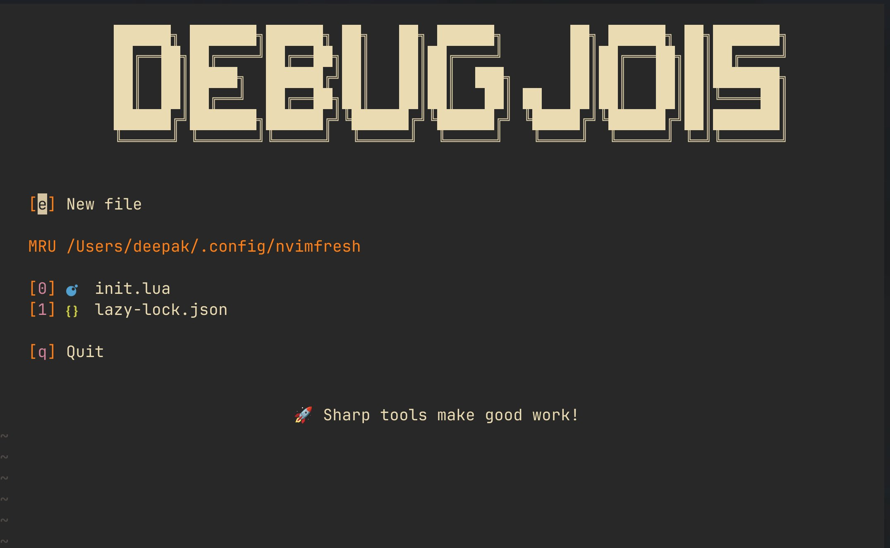

import Counter from '../../components/Counter'
import { Tweet } from 'astro-embed'

Welcome to my first article. This is a simple example of how to write content using MDX.

## What is MDX?

MDX is an extension of Markdown that allows you to use JSX in your content. This means you can:

- Write regular markdown
- Use React components
- Import and use other components
- Add interactive elements

### Example Code Block

#### Javascript

```javascript
console.log('Hello from MDX!')
```

#### Go

```go
import "fmt"

func main() {
    fmt.Println("yo")
}
```

Feel free to explore more articles on this site!

### React component

Here's an interactive counter component:

<Counter client:load />

### Math

$$
\frac{d}{dx}e^x = e^x
$$

Inline: Euler's identity is $e^{i\pi} + 1 = 0$.

## Youtube Embed

https://www.youtube.com/watch?v=AE4wxt70aUM

## Twitter Embed

### Light (By default when using auto-embed)

https://x.com/vikhyatk/status/1915356257164419168

### Dark

<Tweet theme="dark" id="https://x.com/vikhyatk/status/1915356257164419168" />

## Blockquote

> But narrow banking pops up elsewhere. One important modern form is *stablecoins*. A stablecoin is a crypto form of banking: You deposit dollars with a stablecoin issuer, it gives you back tokens entitling you to get your dollars back, and meanwhile it does whatever it wants with the dollars. In the unregulated early days of crypto, “whatever it wants” could be [quite spicy indeed](https://www.bloomberg.com/opinion/articles/2019-04-26/things-got-weird-for-stablecoin-tether), but these days [stablecoins are a big business](https://www.bloomberg.com/opinion/newsletters/2025-04-02/stablecoins-are-growing-up?srnd=undefined) and there is something of a norm of parking the deposits in very safe short-term dollar-denominated assets, ideally Treasury bills or reverse repos or a BlackRock money market fund. If you launched a new stablecoin today and said “we will take your dollars and use them to make loans to emerging crypto entrepreneurs,” you’d have a hard time competing with the big incumbent stablecoins that say “we will take your dollars and use them to buy Treasury bills.” (Especially if, like most stablecoins, you didn’t pay interest.)

## Images


