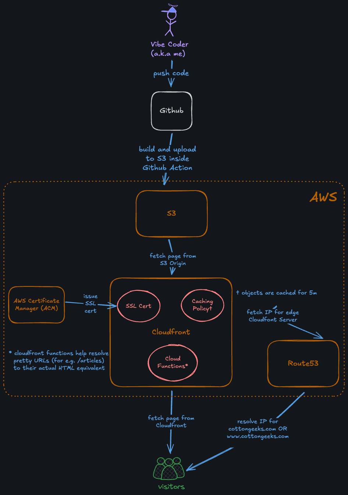
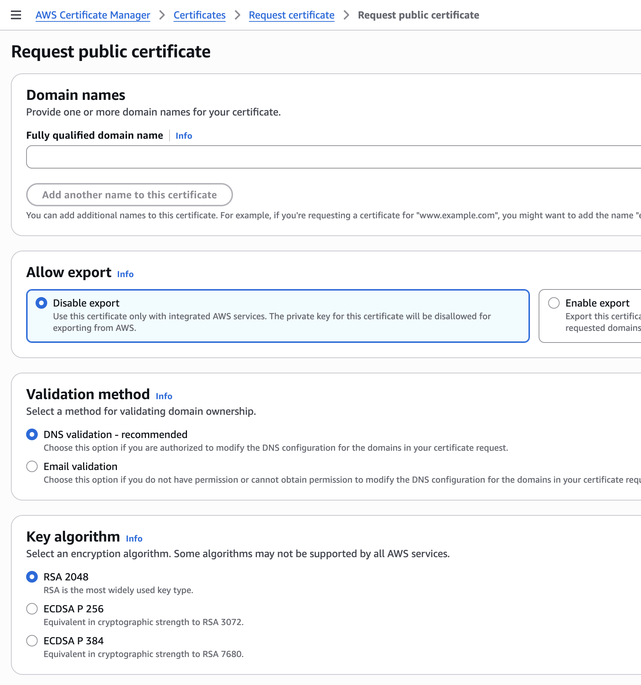
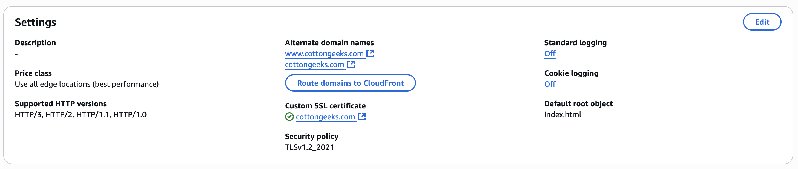

Here is an overview of all the major components involved in building and running this site:



Apart from the code which is hosted in Github, all of the other components are hosted in Amazon Web Services (AWS). I find it amazing that at the moment this costs me a mere 55¢ (yes that's \$0.55) to build and operate. Moreover, _all_ of the \$0.55 goes towards the cost of a Route53 hosted zone that supports DNS routing for the site domain _cottongeeks.com_.

There are plenty of good platforms like Netlify, Cloudfront, Vercel etc which allow free hosting of static websites with a custom domain. But I chose AWS because I already had an account with them, and the DIY nature of the process and the level of customizability appealed to me.

[As Brandur puts it](https://brandur.org/aws-intrinsic-static):

> By composing a few services, we’ll get a static site with some pretty amazing features:
>
> - Approximately unlimited scalability.
> - As close to an operations-free experience as you’re ever likely to find.
> - Full HTTPS support with a certificate that’s renewed automatically.
> - A CDN with dozens of edge locations around the globe so that it’ll load quickly from anywhere.
> - A GitHub-based workflow which will make publishing new content as easy as merging a pull request.

I will go through all the components and how they are configured below. It may be helpful if you are trying to roll your own static site, and looking for options to host it.

## Creating and building the site with Astro

The site is generated using [Astro](https://astro.build/), which [apparently is the new Wordpress](https://websmith.studio/blog/astro-is-a-developers-dream/) according to some folks. I chose to use Astro mainly because I wanted the ability to embed interactive React components in the Markdown formatted articles, using [MDX](https://mdxjs.com/). Astro also had the right mix of customizability and inbuilt features, so as to not feel too heavy handed or prescriptive. It also had excellent documentation.

I was able to write Typescript code to customize many aspects of the site generation process, for e.g custom URL slugs, clipboard copy for anchor links etc. I plan to customize the site more in the future.

The build for the site happens inside a [Github action](https://github.com/cottongeeks/cottongeeks.com/blob/c7794915fa6a1268920fe9bf443bcc32589abc18/.github/workflows/build-deploy.yml#L12-L25)

```yaml
- name: Checkout repository
  uses: actions/checkout@v2

- name: Setup Node.js
  uses: actions/setup-node@v4
  with:
    node-version: '23'

- name: Install dependencies
  run: npm install

- name: Build Vite project
  run: npm run build
```

Astro is not a requirement for this kind of setup. Any framework that builds static files should be fine. My [personal site](https://www.debugjois.dev) hosted on the same setup uses a [custom static site builder written in Go](https://github.com/deepakjois/debugjois.dev).

## Uploading to S3

This is fairly simple with the AWS CLI inside of the [same Github Action](https://github.com/cottongeeks/cottongeeks.com/blob/c7794915fa6a1268920fe9bf443bcc32589abc18/.github/workflows/build-deploy.yml#L27C1-L35C6) that builds the site above

```yaml
- name: Configure AWS credentials
  uses: aws-actions/configure-aws-credentials@v4
  with:
    aws-access-key-id: ${{ secrets.AWS_ACCESS_KEY_ID }}
    aws-secret-access-key: ${{ secrets.AWS_SECRET_ACCESS_KEY }}
    aws-region: us-east-2

- name: Upload to S3
  run: aws s3 sync dist/ s3://cottongeeks-site --delete
```

## SSL certificate with AWS Certificate Manager

I used [AWS Certificate Manager](https://aws.amazon.com/certificate-manager/) to provision a free SSL/TLS certificate for use with AWS.



Once the certificate is provisioned, it can be used by Cloudfront to serve the site over HTTPS.

## CDN with Cloudfront

I created a pretty standard Cloudfront distribution, and chose to automatically redirect HTTP to HTTPS. I attached the SSL certificate from the previous step.



### Pretty URLs and Auto Redirections

I had some very specific and pedantic requirements for the structure of the URLs

- I wanted requests made to _cottongeeks.com_ to permanently redirect to *www.cottongeeks.com* before being served. That way there would only be one canonical hostname for the site.
- I wanted clean URLs without HTML file extensions. So a request made to `/articles` would automatically look for `/articles.html` from the S3 origin.
- I also wanted to redirect URLs with trailing slashes to their non-slash equivalent. For e.g. `/articles/` would redirect to `/articles`, which would eventually serve `/articles.html` from the origin.

I used [CloudFront Functions](https://docs.aws.amazon.com/AmazonCloudFront/latest/DeveloperGuide/cloudfront-functions.html) to do this. Here is the source:

```javascript
var config = {
	suffix: '.html'
};

var regexSuffixless = /\/[^/.]+$/; // e.g. "/some/page" but not "/", "/some/" or "/some.jpg"
var regexTrailingSlash = /.+\/$/; // e.g. "/some/" or "/some/page/" but not root "/"


function handler(event) {
	var request = event.request;
	// Redirect cottongeeks.com to www.cottongeeks.com
    if (request.headers.host.value == 'cottongeeks.com') {
            var response = {
        statusCode: 301,
        statusDescription: 'Moved Permanently',
        headers: {
            'location': {value: 'https://www.cottongeeks.com' + event.request.uri }
        }
    };
    return response;
    }


	var uri = request.uri;
	var suffix = config.suffix;
	var appendToDirs = config.appendToDirs;
	var removeTrailingSlash = config.removeTrailingSlash;

	// Append ".html" to origin request if it doesnt have a suffix
	if uri.match(regexSuffixless) {
		request.uri = uri + suffix;
		return request;
	}

	// Redirect (301) non-root requests ending in "/" to URI without trailing slash
	if uri.match(/.+\/$/) {
		response = {
			statusCode: 301,
			statusDescription: 'Moved Permanently',
			headers: {
				'location': { value: uri.slice(0, -1) }
			}
		};
		return response;
	}
    return request;
}
```

There are other (albeit more clunkier) ways to achieve this. For example my [personal website](https://www.debugjois.dev/) uploads HTML files to S3 _without an extension_ and then sets the mime-type to `text/html` so that they are served correctly to the browser by CloudFront. (see [upload code](https://github.com/deepakjois/debugjois.dev/blob/89464acacf363d598b39b7846c983915b7837650/upload.go#L115-L133))

## DNS Routing with Route53

I used a [Route53 Hosted Zone](https://docs.aws.amazon.com/Route53/latest/DeveloperGuide/hosted-zones-working-with.html) to manage DNS records for the cottongeeks.com domain. Route53 allows A records to be aliased to a CloudFront distribution. I aliased both `cottongeeks.com` and `www.cottongeeks.com` to the same distribution we created above.

![[hosted_zone_alias_cf.png]]

## Testing

After configuring all this, I can finally verify that my website is served from the nearest of CloudFront POPs (Points of Presence)

```
curl https://www.cottongeeks.com

> GET / HTTP/2
> Host: www.cottongeeks.com
> User-Agent: curl/8.7.1
> Accept: */*
>
* Request completely sent off
< HTTP/2 200
< content-type: text/html
< content-length: 4836
< date: Tue, 24 Jun 2025 21:23:36 GMT
< last-modified: Tue, 24 Jun 2025 11:14:26 GMT
< etag: "5854048c759d2fa3e44e703d50adb122"
< x-amz-server-side-encryption: AES256
< accept-ranges: bytes
< server: AmazonS3
< x-cache: Hit from cloudfront
< via: 1.1 a49f020132dfafabe09a4d42b8bfbc4c.cloudfront.net (CloudFront)
< x-amz-cf-pop: BLR50-P4
< alt-svc: h3=":443"; ma=86400
< x-amz-cf-id: _bO6JBqQhGQe6m_XCavNTZEMhniXOsJyqPg3RDIWCvCFCgCNhcFUxQ==
< age: 12
```

As we can see, it is being served on `HTTP/2` from the `BLR50-P4` POP, which I can only assume is located in Bengaluru (where I am at currently).
